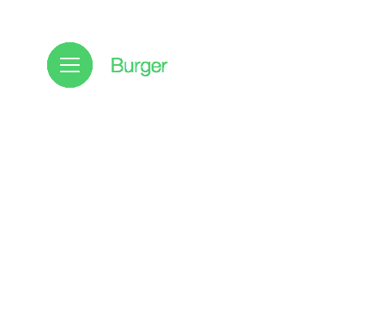

# ♡ MENÚ  HAMBURGUESA ♡

Un menú de hamburguesa nos permite tener escondido el menú y únicamente mostrar un botón (3 líneas horizontales) que cuando lo apretamos (o hacemos click), se muestra en la pantalla todas las opciones del menú.

Algo así:

Replicar esa funcionalidad usando DOM y CSS. (No agregar efectos "bonitos", únicamente enfocarse en funcionalidad)
